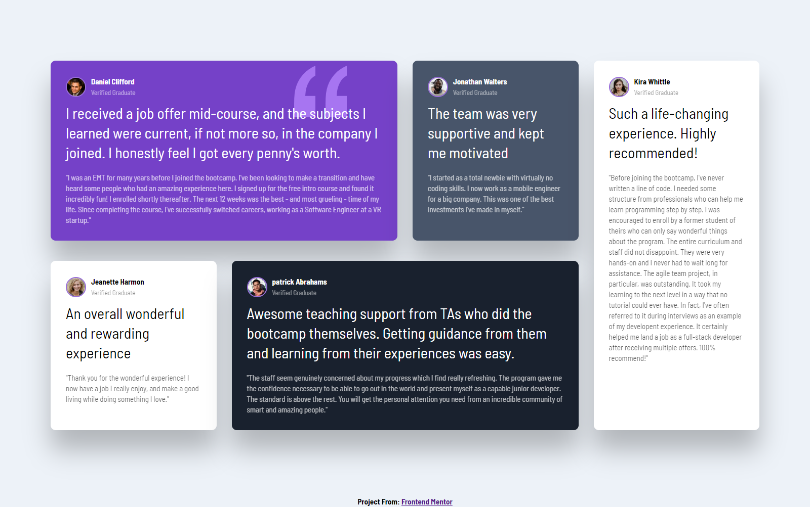

# Frontend Mentor - Testimonials grid section solution

This is a solution to the [Testimonials grid section challenge on Frontend Mentor](https://www.frontendmentor.io/challenges/testimonials-grid-section-Nnw6J7Un7). Frontend Mentor challenges help you improve your coding skills by building realistic projects. 

## Table of contents

- [Frontend Mentor - Testimonials grid section solution](#frontend-mentor---testimonials-grid-section-solution)
  - [Table of contents](#table-of-contents)
  - [Overview](#overview)
    - [The challenge](#the-challenge)
    - [Screenshot](#screenshot)
    - [Links](#links)
  - [My process](#my-process)
    - [Built with](#built-with)
    - [What I learned](#what-i-learned)
  - [Author](#author)


## Overview

### The challenge

Users should be able to:

- View the optimal layout for the site depending on their device's screen size

### Screenshot




### Links

- Solution URL: [GitHub](https://github.com/Trayshmhirk/testimonial-grid-section)
- Live Site URL: [Netlify](https://testimonial-gridsection-fm.netlify.app/)

## My process

### Built with

- Semantic HTML5 markup
- CSS custom properties
- Flexbox
- CSS Grid

### What I learned

```css
@media (max-width: 800px){
   #testimonial{
      grid-template-columns: 1fr;
      width: 100%;
   }

   .card:nth-of-type(1){
      grid-column: 1;
   }
   
   .card:nth-of-type(4){
      grid-column: 1;
      grid-row: 4;
   }
   
   .card:nth-of-type(5){
      grid-column: 1;
      grid-row: 5; 
   }
}
```

## Author

- Frontend Mentor - [@Trayshmhirk](https://www.frontendmentor.io/profile/Trayshmhirk)
- Twitter - [@TrayShmhirk01](https://www.twitter.com/TrayShmhirk01)


